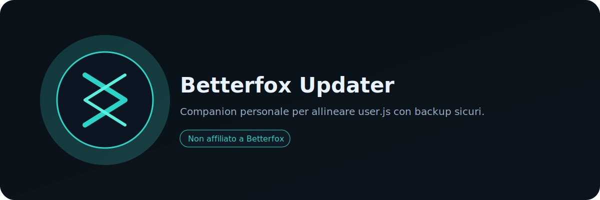

# Betterfox Updater




App Electron personale per allineare `user.js` di Betterfox con backup sicuri e percorso guidato.

## Download (Releases)
- Vai nelle Releases: trovi solo **draft** o **prerelease** (nessuna release finale automatica).

## Come si usa (3 step)
1) Seleziona il profilo Firefox.
2) Imposta la cartella backup (consigliato).
3) Esegui update e riavvia Firefox.

## Dev (Electron)
```bash
cd app-electron
npm ci
npm run dev
```

## Build
```bash
cd app-electron
npm run build
```

## Release (draft)
- Workflow manuale o tag `vX.Y.Z`.
- La release viene creata **solo** come draft/prerelease e allega gli artifact Windows.

## Screenshot
- In arrivo. Catturare uno screenshot reale in `docs/assets/screenshots/`.

## Note importanti
- Progetto principale: `app-electron/`.
- Legacy Python archiviato in `archive/python-legacy/` (solo riferimento).

## Disclaimer
Betterfox Updater non e affiliato a Betterfox o Mozilla/Firefox.

## License
MIT