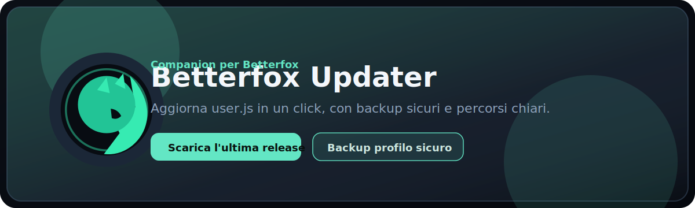

# Betterfox Updater



App desktop (Electron + React) per tenere `user.js` di Betterfox sempre allineato: UI compatta, backup sicuri, percorsi chiari. Tema System/Light/Dark. Icona app inclusa (Start menu/Taskbar/Tray).

## Cosa c’è dentro
- Controllo versioni: locale, remoto e ultimo commit Betterfox.
- Aggiorna `user.js` con backup automatico opzionale e retention giorni.
- Rilevamento profili Firefox, scelta cartella backup, link rapidi a repo/changelog.
- Tema System/Light/Dark, log leggibile, azioni rapide senza fronzoli.

## Uso rapido
1) `cd app-electron && npm install`  
2) Dev: `npm run dev` (parte Vite + Electron)  
3) In app: scegli profilo Firefox, cartella backup, premi **Aggiorna Betterfox**.  

## Build
```bash
cd app-electron
npm run build
```
Trovi i binari in `app-electron/release/` (configurato con electron-builder).

## Versioni e release
- Versione Electron corrente: `0.1.0` (vedi `CHANGELOG.md`).
- Usa `npm version <patch|minor|major>` per bump coerente, poi `npm run build` e `git push --tags`.
- Il canale Python (`app/`) è legacy: tenuto per riferimento, sviluppo attivo solo su Electron.

## Note
- Richiede Firefox chiuso per copiare/scrivere `user.js`.
- I dati (config/log) sono gestiti da Electron: i backup restano dove li imposti tu.
- La vecchia UI Python è mantenuta in `app/` ma considerata legacy; lo sviluppo attivo è su `app-electron/`.
- Progetto personale: UI pensata per essere semplice, niente funzioni superflue. Titoli e testi sono chiari per chi non è tecnico.
